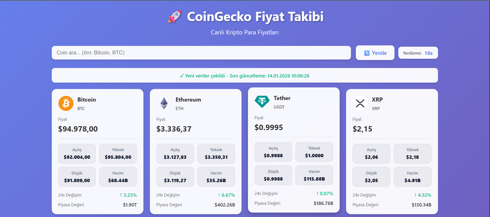

# CoinGecko Kripto Para Fiyat Takibi

CoinGecko API kullanarak canlı kripto para fiyatlarını gösteren basit ve modern bir React uygulaması.

## Özellikler

- Canlı kripto para fiyat takibi
- 60 saniyede bir otomatik güncelleme
- Arama özelliği
- Modern ve responsive tasarım
- Docker ile kolay deployment

## Ekran Görüntüsü



## Hangi API Kullanılıyor?

Bu projede [CoinGecko](https://www.coingecko.com) tarafından sunulan **Public API** kullanılmaktadır.

Kullanılan temel endpoint:

- `GET https://api.coingecko.com/api/v3/coins/markets`

Temel sorgu parametreleri:

- `vs_currency=usd`  
  Fiyatların hangi para birimi cinsinden gösterileceğini belirtir (burada ABD Doları).

- `order=market_cap_desc`  
  Coin'leri piyasa değerine göre büyükten küçüğe sıralar.

- `per_page=20`  
  Her sayfada gösterilecek coin sayısını belirler (burada 20 adet).

- `page=1`  
  Hangi sayfanın çekileceğini belirtir (ilk sayfa).

- `sparkline=false`  
  Ekstra sparkline (mini grafik) verilerini kapatır.

İstek örneği:

```text
GET https://api.coingecko.com/api/v3/coins/markets
  ?vs_currency=usd
  &order=market_cap_desc
  &per_page=20
  &page=1
  &sparkline=false
```

İsteğe ek olarak, daha yüksek rate limit için CoinGecko tarafından verilen bir API anahtarı kullanılır. Bu anahtar, HTTP header içinde gönderilir:

- Header: `x-cg-demo-api-key: <API_KEY>`

### API'den Gelen Temel Alanlar

Backend'ten dönen JSON listesi, her coin için aşağıdaki gibi alanlar içerir (proje bunların bir kısmını kullanır):

- `id`: Coin’in benzersiz ID’si (ör: `"bitcoin"`)
- `symbol`: Sembol (ör: `"btc"`)
- `name`: Coin adı (ör: `"Bitcoin"`)
- `image`: Coin logosu için görsel URL’si
- `current_price`: Anlık fiyat
- `market_cap`: Piyasa değeri
- `price_change_percentage_24h`: Son 24 saatteki fiyat değişim yüzdesi
- `total_volume`: İşlem hacmi

Bu alanlar frontend tarafında kartlar üzerinde görüntülenir ve fiyat değişimlerine göre stiller (yeşil/kırmızı) uygulanır.

## Kurulum

### Yerel Geliştirme

1. Bağımlılıkları yükleyin:

```bash
npm install
```

2. Geliştirme sunucusunu başlatın:

```bash
npm run dev
```

3. Tarayıcınızda `http://localhost:3000` adresini açın.

### Production Build

```bash
npm run build
```

Build dosyaları `dist` klasörüne oluşturulacaktır.

## Docker ile Çalıştırma

### Docker Compose ile (Önerilen)

Önemli: Docker build sırasında API key'i environment variable olarak geçirmeniz gerekiyor:

```bash
# API key ile build
docker-compose build --build-arg VITE_COINGECKO_API_KEY=CG-vswhaUMrwb3BaQLbXMQx2jpB

# Container'ı başlat
docker-compose up -d
```

Veya `docker-compose.yml` dosyasında environment variable tanımlayabilirsiniz.

Uygulama `http://localhost:2230` adresinde çalışacaktır.

### Docker ile Tek Komut

```bash
# Image oluştur
docker build -t coin-tracker .

# Container çalıştır
docker run -d -p 2230:80 --name coin-tracker coin-tracker
```

## Kullanılan Teknolojiler

- React 18 – Arayüz kütüphanesi
- Vite – Geliştirme ve build aracı
- CoinGecko API – Kripto para verileri
- Docker – Containerization
- Nginx – Production web sunucusu

## Yapılandırma

### Port Değiştirme

Docker Compose kullanıyorsanız `docker-compose.yml` dosyasındaki port ayarını değiştirebilirsiniz:

```yaml
ports:
  - "2230:80"
```

### API Ayarları

CoinGecko API ayarları `src/App.jsx` dosyasında bulunmaktadır. İsterseniz:

- Görüntülenecek coin sayısını (`per_page`)
- Para birimini (`vs_currency`)
- Güncelleme sıklığını (`setInterval` değeri, saniye cinsinden)

değiştirebilirsiniz.

## Notlar

- CoinGecko API key kullanıldığında daha yüksek rate limit'e sahipsiniz.
- Uygulama varsayılan olarak 60 saniyede bir güncellenir.
- API key `.env` dosyasında saklanmalı ve git'e commit edilmemelidir.
- `.env` dosyası `.gitignore` içinde bulunmaktadır.

## Deployment

Sunucuya deploy etmek için:

1. Docker Compose dosyasını sunucuya yükleyin.
2. `docker-compose up -d` komutu ile çalıştırın.
3. Nginx reverse proxy ile domain bağlayabilirsiniz.

## Lisans

Bu proje eğitim amaçlıdır.

